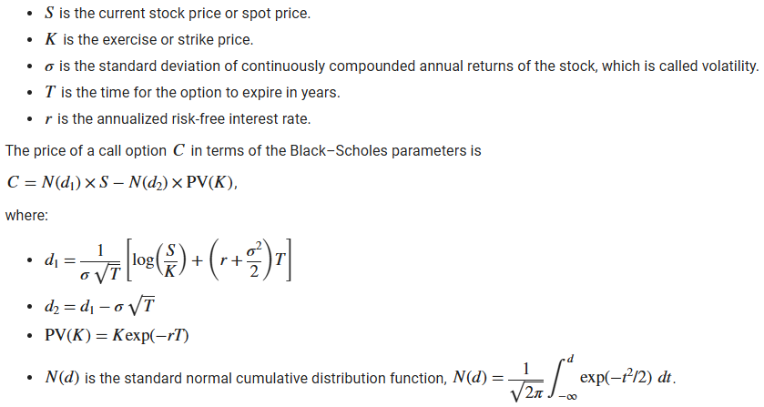

# Feature Engineering:
Feature engineering is the process of selecting, creating, and transforming raw data into meaningful inputs (features) that a machine learning model can use to make better predictions. It involves cleaning data, creating new variables, and selecting the most important information to help the model learn patterns more effectively.

In options trading, feature engineering is like selecting and crafting the right financial indicators or variables that help predict option prices or trading signals. For example, traders might use technical indicators (like moving averages, RSI, or volatility measures) as features to capture market trends and momentum. The Black-Scholes model provides theoretical option prices based on variables like stock price, strike price, volatility, time to expiration, and interest rates.

# The Black-Scholes Model

The Black-Scholes Model is a mathematical formula used to calculate the theoretical price of European-style options. It assumes that markets are efficient, and that the price of the underlying asset follows a lognormal distribution with constant volatility and interest rates.

The model takes into account several factors:

* Current stock price
* Strike price of the option
* Time until expiration
* Risk-free interest rate
* Volatility of the stock

Using these inputs, the Black-Scholes formula outputs the fair value of a call or put option, helping traders assess whether an option is overpriced or underpriced in the market. It's widely used in finance and forms the foundation of modern options pricing.

# Option Greeks

Greeks are financial metrics that measure the sensitivity of an option’s price to various factors. They help traders understand how an option’s value may change with shifts in the market. In this simulation, Greeks can guide agents in managing risk and making more informed trading decisions.

Here are the key Greeks:

* Delta (Δ):  
Measures how much the option's price changes in response to a $1 change in the underlying stock's price.
Example: A Delta of 0.5 means the option price increases $0.50 if the stock rises $1.   

* Gamma (Γ):  
Measures the rate of change of Delta with respect to the stock price.
Higher Gamma means Delta can change quickly, affecting option risk.   

* Theta (Θ):  
Measures how much the option’s value decreases as time passes (time decay).
Especially important as expiration approaches.   

* Vega (ν):  
Measures sensitivity to volatility.
Higher Vega means the option is more sensitive to changes in implied volatility.   

# Indicators
Indicators are mathematical calculations based on the price, volume, or open interest of a security. Traders and analysts use them to analyze market trends, forecast future price movements, and make informed trading decisions.

# Indicators used:

## EMA (Exponential Moving Average)
The Exponential Moving Average is a type of moving average that gives more weight to recent prices, making it more responsive to current market activity than the Simple Moving Average (SMA) which simply averages all the prices

## RSI (Relative Strength Index)
RSI measures the speed and change of price movements on a scale from 0 to 100.
Values above 70 typically indicate an overbought condition (possible price reversal down).
Values below 30 suggest an oversold condition (possible price reversal up).
It helps traders assess whether an asset is overextended in either direction.

## Stochastic Oscillator
The Stochastic Oscillator compares a security’s closing price to its price range over a specified period (commonly 14 days).
It produces two lines: %K (current closing price relative to the range) and %D (moving average of %K).
Values range from 0 to 100; readings above 80 indicate overbought, below 20 indicate oversold.
It’s useful for identifying potential reversals or confirming trend strength.

## ADX (Average Directional Index)
ADX (Average Directional Index) measures the strength of a trend over a specified period, regardless of direction.
It ranges from 0 to 100 — higher values indicate a stronger trend.
Rising ADX suggests a trend is gaining strength, while falling ADX signals weakening momentum.

## CMF (Chaikin Money Flow)
CMF measures the buying and selling pressure over a specified period by combining price and volume data.
It oscillates between -1 and +1.
Positive CMF values indicate buying pressure (accumulation), while negative values suggest selling pressure (distribution).
Traders use CMF to confirm trends and identify potential reversals based on money flow intensity.