# Reinforcement Learning:
Reinforcement learning is a process where an agent learns by interacting with an environment. It takes actions and gets rewards or penalties based on those actions. Over time, the agent improves its decisions to maximize the total rewards it receives.
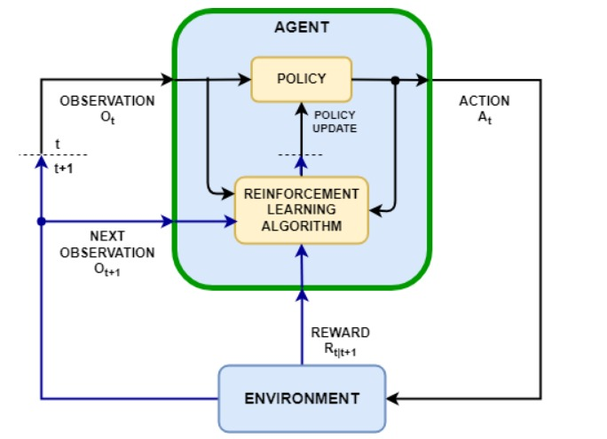

# Reinforcement learning algorithms used:

## 1. SAC (Soft - Actor Critic)
SAC uses:  
**1. Actor Network**
Chooses actions by sampling from a learned probability distribution.  
**2. Critic Networks (2x)**
Evaluate how good a specific action is in a given state by estimating its expected future reward (Q-value); two are used for stability.  
**3. Value Network**
Estimates how good a state is overall, assuming the agent follows its current policy, regardless of specific actions.  
**4. Target Value Network**
A slowly-updated copy of the value network that provides stable targets during training to prevent instability.   

SAC maximizes the expected reward plus an entropy term to encourage exploration.  
### Entropy term:
Let x be a random variable with probability mass or density function P. The entropy H of x is computed from its distribution P according to:  
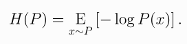   
The RL problem changes to:  
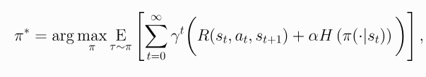   
### Actor update : 
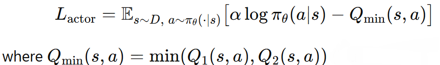   

### Critic update:  
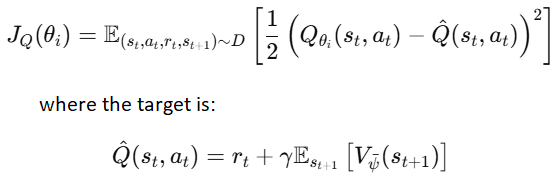   

### Value update: 
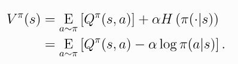  
The minimum of the 2 critics values is taken   

### Target value soft update:  
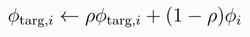  

## 1. DDPG (Deep Deterministic Policy Gradient)
DDPG uses:  
**1. Actor Network**
A deterministic policy network that outputs the exact action to take in a given state. It aims to maximize the expected Q-value as judged by the critic.  
**2. Critic Network**
Estimates the Q-value: how good a given action is in a specific state under the current policy.  
**3. Target Actor Network**
A delayed, slowly-updated copy of the actor network used to generate target actions during critic updates. It improves stability by avoiding rapid policy changes.  
**4. Target Critic Network**
A slowly-updated copy of the critic network used to compute stable Q-targets when training the main critic.  

### Target for critic:
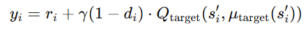

### Critic update:  
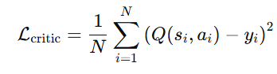

### Actor update:  
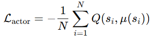

### Soft actor and critic update:  
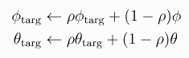

